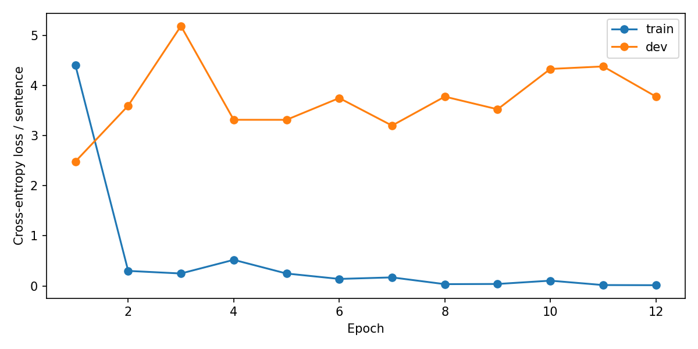
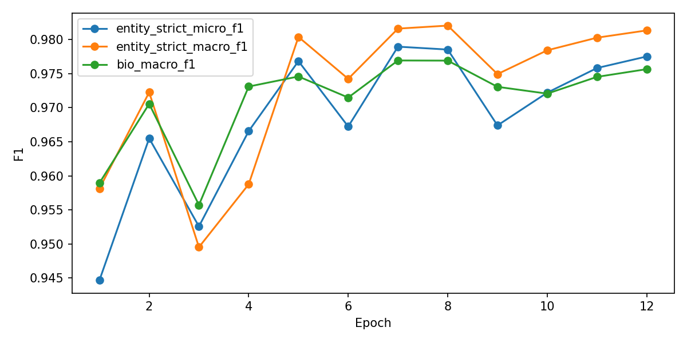

# XLM-RoBERTa + Softmax cho PAP_NER

Fine-tune **`FacebookAI/xlm-roberta-base`** cho bài toán nhận dạng thực thể (NER) trên dữ liệu tiếng Việt **PAP_NER**. Mô hình dùng encoder XLM-RoBERTa, dropout và linear classifier; loss là cross-entropy, dự đoán nhãn bằng argmax.

Repository lưu mã runner độc lập, cấu hình và các output đã xuất sau training: biểu đồ, lịch sử train, kết quả test và đánh giá mở rộng. Các kết quả bên dưới thuộc run **`papner_xlm_r_softmax_20ep_rtx3090_24gb`**.

**Kết quả chính:** Entity Strict Micro F1 trên test đạt **97,9687%**; checkpoint tốt nhất được chọn tại **epoch 7** theo Dev Entity Strict Micro F1 (**97,8952%**).

## Tải trọng số đã train

👉 **[Tải checkpoint trên Google Drive](https://drive.google.com/drive/folders/1qw4GzeTGBXQuhD685SZc87iRlOe7Hv0M?usp=sharing)**

File `best_model.pt` có dung lượng **1.112.277.447 bytes** (khoảng **1,11 GB / 1,04 GiB**), được phân phối qua Drive và không đưa vào Git. Sau khi tải, đặt file theo hướng dẫn ở phần chạy mô hình bên dưới.

SHA-256 của checkpoint gốc để đối chiếu file tải về:

```text
83b358605763e66bf93baa5bf927391bb9668b37802e2f16844ded4fa2aa21a9
```

Checkpoint được lưu bằng `torch.save`, gồm state dict trong khóa `model`, danh sách nhãn `classes`, `config`, `args`, `epoch` và `metrics`. Khi dùng lại checkpoint, sử dụng kiến trúc `BackboneTokenClassifier` trong [runner](papner_multimodel_classifier_runner.py). Thư mục `model_config/` và `tokenizer/` lưu các cấu hình/tokenizer đã xuất từ lần train.

## Dữ liệu và nhãn

- Dataset: [`Leekien0108/PAP_NER`](https://huggingface.co/datasets/Leekien0108/PAP_NER).
- Revision cố định: `7a0f6b1233667702925baa69c07c55d5d26eb6cd`.
- Dùng ba split chính thức: `train_data.txt`, `dev_data.txt`, `test_data.txt`.
- Năm loại thực thể: `CQ`, `ĐT`, `VBPL`, `NG`, `SL`; tổng cộng **11 nhãn BIO** tính cả `O`.
- Với file PAP_NER nhiều cột, runner đọc từ ở cột 1 và nhãn NER ở **cột 4** (đếm từ 1).
- Nhãn được căn theo **subword đầu tiên của mỗi từ**. Các subword tiếp theo không tham gia loss/evaluation.
- Theo [dataset_stats.json](dataset_stats.json) và [test_metrics.json](test_metrics.json), không có câu bị cắt hoặc từ bị loại ở cả ba split trong lần chạy này.
- Output dự đoán test có **10.278 câu**, **243.616 token**; strict entity report ghi nhận **20.977 thực thể**.

```text
O
B-CQ, I-CQ
B-ĐT, I-ĐT
B-VBPL, I-VBPL
B-NG, I-NG
B-SL, I-SL
```

## Cấu hình training

Các giá trị được lấy từ [run_config.json](run_config.json).

| Tham số | Giá trị |
| --- | --- |
| Backbone | `FacebookAI/xlm-roberta-base` |
| Head | Dropout + Linear / Softmax |
| GPU profile | RTX 3090 24 GB |
| Precision | FP16 |
| Max sequence length | 256 subword tokens |
| Train / Eval batch size | 32 / 32 |
| Gradient accumulation | 1; effective batch = 32 |
| Encoder learning rate | `2e-5` |
| Classifier learning rate | `1e-3` |
| Optimizer | AdamW |
| Scheduler | Linear warmup/decay |
| Warmup proportion | 0,1 |
| Weight decay | 0,01 |
| Adam epsilon | `1e-6` |
| Gradient clipping | 1,0 |
| Dropout | 0,1 |
| Seed | 42 |
| Epochs tối đa | 20 |
| Early stopping patience | 5 |
| Chọn best checkpoint | Dev Entity Strict Micro F1 |
| Gradient checkpointing | Tắt |

Lịch sử thực tế có **12 epoch**. Best Dev Strict Micro F1 đạt ở epoch 7; năm epoch tiếp theo không cải thiện nên training dừng sớm. Tổng thời gian các epoch trong `history.json` khoảng **101,15 phút**, peak VRAM ghi nhận **8,34 GiB**. Thời gian này không bao gồm tải dữ liệu, khởi tạo môi trường và đánh giá test.

## Biểu đồ sau training

### Train / Dev loss



Ảnh được giữ nguyên từ output đã xuất. Nguồn số liệu loss theo từng epoch: [history.json](history.json).

### F1 trên tập dev



Các đường F1 trong hình là kết quả **dev**, dùng theo dõi training và chọn checkpoint. Kết quả **test** được trình bày riêng bên dưới.

## Text output của lịch sử training

Định dạng lại các số liệu từ [history.json](history.json) để đọc trực tiếp trên GitHub:

```text
Epoch  1: Strict Micro F1=94.4667% | Strict Macro F1=95.8119% | BIO Macro F1=95.8942% | VRAM=8.34 GiB | time=8.43 min
Epoch  2: Strict Micro F1=96.5498% | Strict Macro F1=97.2253% | BIO Macro F1=97.0559% | VRAM=8.34 GiB | time=8.45 min
Epoch  3: Strict Micro F1=95.2572% | Strict Macro F1=94.9528% | BIO Macro F1=95.5718% | VRAM=8.34 GiB | time=8.45 min
Epoch  4: Strict Micro F1=96.6557% | Strict Macro F1=95.8757% | BIO Macro F1=97.3100% | VRAM=8.34 GiB | time=8.43 min
Epoch  5: Strict Micro F1=97.6829% | Strict Macro F1=98.0381% | BIO Macro F1=97.4577% | VRAM=8.34 GiB | time=8.43 min
Epoch  6: Strict Micro F1=96.7228% | Strict Macro F1=97.4230% | BIO Macro F1=97.1485% | VRAM=8.34 GiB | time=8.43 min
Epoch  7: Strict Micro F1=97.8952% | Strict Macro F1=98.1600% | BIO Macro F1=97.6925% | VRAM=8.34 GiB | time=8.43 min
Epoch  8: Strict Micro F1=97.8529% | Strict Macro F1=98.2044% | BIO Macro F1=97.6905% | VRAM=8.34 GiB | time=8.41 min
Epoch  9: Strict Micro F1=96.7395% | Strict Macro F1=97.4927% | BIO Macro F1=97.3058% | VRAM=8.34 GiB | time=8.44 min
Epoch 10: Strict Micro F1=97.2201% | Strict Macro F1=97.8418% | BIO Macro F1=97.2058% | VRAM=8.34 GiB | time=8.43 min
Epoch 11: Strict Micro F1=97.5816% | Strict Macro F1=98.0270% | BIO Macro F1=97.4519% | VRAM=8.34 GiB | time=8.41 min
Epoch 12: Strict Micro F1=97.7512% | Strict Macro F1=98.1338% | BIO Macro F1=97.5651% | VRAM=8.34 GiB | time=8.42 min
```

## Kết quả trên tập test

Đánh giá best checkpoint bằng **seqeval**, `mode="strict"`, `scheme=IOB2`. Một thực thể đúng khi khớp đầy đủ biên và loại thực thể theo cách xử lý BIO của seqeval.

| Metric | Kết quả |
| --- | --- |
| Entity Strict Micro Precision | 98.5763% |
| Entity Strict Micro Recall | 97.3685% |
| **Entity Strict Micro F1** | 97.9687% |
| Entity Strict Macro F1 | 97.8597% |
| BIO Token Accuracy | 99.3514% |
| BIO Token Macro F1 | 97.8085% |

Test loss per sentence: **2,796339**. Kết quả gốc: [test_metrics.json](test_metrics.json).

### Classification report

Output đầy đủ từ [test_report.txt](test_report.txt). Precision, recall và F1 trong khối dưới dùng thang **0–1**; `support` là số thực thể ở phần entity report và số token ở phần BIO report.

```text
precision    recall  f1-score   support

          CQ     0.9883    0.9631    0.9755      7311
          NG     1.0000    1.0000    1.0000      4021
          SL     0.9814    0.9658    0.9735      1638
        VBPL     0.9630    0.9746    0.9688       828
          ĐT     0.9788    0.9714    0.9751      7179

   micro avg     0.9858    0.9737    0.9797     20977
   macro avg     0.9823    0.9750    0.9786     20977
weighted avg     0.9858    0.9737    0.9797     20977

BIO token report
              precision    recall  f1-score   support

           O     0.9944    0.9983    0.9963    205461
        B-CQ     0.9920    0.9666    0.9791      7311
        I-CQ     0.9669    0.8524    0.9061      2677
        B-ĐT     0.9934    0.9859    0.9897      7179
        I-ĐT     0.9835    0.9317    0.9569      6003
      B-VBPL     0.9726    0.9843    0.9784       828
      I-VBPL     0.9722    0.9993    0.9856      2801
        B-NG     1.0000    1.0000    1.0000      4021
        I-NG     1.0000    1.0000    1.0000      4023
        B-SL     0.9963    0.9805    0.9883      1638
        I-SL     0.9762    0.9809    0.9785      1674

    accuracy                         0.9935    243616
   macro avg     0.9861    0.9709    0.9781    243616
weighted avg     0.9935    0.9935    0.9934    243616
```

### Đánh giá mở rộng

Output tổng hợp từ [advanced_eval_summary.json](advanced_eval_summary.json), theo các chế độ Strict, Partial, Entity Type và Exact:

| Chế độ | Micro Precision | Micro Recall | Micro F1 |
| --- | --- | --- | --- |
| Strict | 98.4387% | 97.3736% | 97.9032% |
| Partial | 98.9856% | 97.9146% | 98.4472% |
| Entity Type | 99.4892% | 98.4127% | 98.9480% |
| Exact | 98.4387% | 97.3736% | 97.9032% |

Bảng chi tiết theo từng loại thực thể: [Markdown](advanced_eval_table.md) · [CSV](advanced_eval_table.csv) · [HTML](advanced_eval_table.html).

**Lưu ý khi so sánh:** output đánh giá mở rộng ghi nhận `possible = 20.979`, trong khi seqeval strict report có `support = 20.977`. Sự khác biệt về số thực thể được đếm cho thấy hai bộ đánh giá không hoàn toàn tương đương: strict F1 mở rộng là **97,9032%**, còn strict F1 chính là **97,9687%**. Khác biệt trong xử lý chuỗi BIO có thể là một nguyên nhân; cần đối chiếu mã đánh giá để kết luận cụ thể. Các số liệu gốc được giữ nguyên; metric chính của lần train là **seqeval Entity Strict Micro F1**.

## Chạy lại training, test và inference

### 1. Clone và cài môi trường

Lần train gốc sử dụng **PyTorch 2.5.1 + CUDA 12.1**, **Transformers 4.44.2** và FP16. Các lệnh sau dành cho Linux với GPU tương thích profile này:

```bash
git clone https://github.com/yummiyummihoang/XLM-RoBERT.git
cd XLM-RoBERT
python3 -m venv .venv
source .venv/bin/activate
python -m pip install --upgrade pip
python -m pip install torch==2.5.1 --index-url https://download.pytorch.org/whl/cu121
python -m pip install transformers==4.44.2 numpy==1.26.4 scikit-learn==1.5.2 seqeval==1.2.2 sentencepiece==0.2.0 protobuf==5.28.3 tensorboard==2.18.0 tqdm==4.66.5 huggingface_hub==0.36.2
```

[requirements-frozen.txt](requirements-frozen.txt) lưu toàn bộ phiên bản của môi trường gốc để tham khảo. Nếu mở notebook riêng để sử dụng runner, cần cài thêm môi trường Jupyter phù hợp.

### 2. Tải dataset và tạo cấu hình theo máy hiện tại

`run_config.json` và `launch_config.json` giữ nguyên đường dẫn Linux của lần train gốc. Tạo `config.local.json` với đường dẫn trên máy hiện tại:

```bash
python - <<'PY'
import json
from pathlib import Path
from huggingface_hub import snapshot_download

root = Path.cwd()
cfg = json.loads((root / "run_config.json").read_text(encoding="utf-8"))
data_dir = root / "hf-datasets" / cfg["dataset_revision"]
snapshot_download(
    repo_id=cfg["dataset_repo"],
    repo_type="dataset",
    revision=cfg["dataset_revision"],
    allow_patterns=["train_data.txt", "dev_data.txt", "test_data.txt"],
    local_dir=str(data_dir),
)
cfg["data_files"] = {
    split: str(data_dir / f"{split}_data.txt")
    for split in ("train", "dev", "test")
}
cfg["output_dir"] = str(root / "runs" / "papner_xlm_r_softmax_20ep_rtx3090_24gb")
cfg["cache_dir"] = str(root / "feature-cache")
Path(cfg["output_dir"]).mkdir(parents=True, exist_ok=True)
(root / "config.local.json").write_text(
    json.dumps(cfg, ensure_ascii=False, indent=2), encoding="utf-8"
)
print("Config:", root / "config.local.json")
print("Đặt best_model.pt tải từ Drive vào:", cfg["output_dir"])
PY
```

### 3. Đánh giá checkpoint tải từ Drive

Đặt file vào:

```text
runs/papner_xlm_r_softmax_20ep_rtx3090_24gb/best_model.pt
```

Sau đó chạy:

```bash
python papner_multimodel_classifier_runner.py test --config config.local.json
```

Runner ghi `test_metrics.json`, `test_predictions.json` và `test_report.txt` vào thư mục `output_dir` trong cấu hình local.

### 4. Inference với câu đã word-segment

Đầu vào cần được word-segment theo cách biểu diễn của PAP_NER; các từ ghép dùng dấu gạch dưới. Với văn bản thô, thực hiện word segmentation trước.

```bash
python papner_multimodel_classifier_runner.py predict   --config config.local.json   --text "Uỷ_ban_nhân_dân tỉnh Thái_Bình ban_hành Nghị_định 123/2020/NĐ-CP ngày 15 tháng 10 năm 2020 ."
```

Runner in từng từ và nhãn BIO dự đoán. Ví dụ trên là **lệnh sử dụng**, không phải output inference đã được xác nhận của checkpoint này.

### 5. Train một run mới

Đổi `output_dir` trong `config.local.json` sang một thư mục run mới chưa chứa checkpoint; giữ `resume = false`. Chạy smoke test, sau đó train:

```bash
python papner_multimodel_classifier_runner.py smoke --config config.local.json
python papner_multimodel_classifier_runner.py train --config config.local.json
```

Để tiếp tục một run đã train, cần **`last_checkpoint.pt`** và `resume = true`. Chỉ `best_model.pt` không đủ để resume vì không chứa toàn bộ trạng thái optimizer/scheduler/RNG của checkpoint cuối.

## Các file trong repository

| File / thư mục | Nội dung |
| --- | --- |
| `papner_multimodel_classifier_runner.py` | Runner với các mode `smoke`, `train`, `test`, `predict` |
| `run_config.json`, `launch_config.json` | Cấu hình gốc của lần train |
| `history.json` | Loss, F1, thời gian và VRAM của 12 epoch |
| `training_loss.png`, `training_f1.png` | Biểu đồ đã xuất sau training |
| `test_metrics.json`, `test_report.txt` | Metric tổng hợp và classification report |
| `test_predictions.json` | Các chuỗi nhãn gold/pred trên test |
| `advanced_eval_summary.json` | Output đánh giá mở rộng |
| `advanced_eval_table.{md,csv,html}` | Bảng đánh giá theo loại thực thể |
| `dataset_stats.json` | Thống kê cắt câu/từ và fingerprint train/dev |
| `tokenizer/`, `model_config/` | Tokenizer và cấu hình mô hình đã xuất |
| `requirements-frozen.txt` | Danh sách phiên bản package của môi trường train |
| `.gitignore` | Loại checkpoint/trọng số và file phát sinh khỏi Git |

Trọng số `best_model.pt`: tải qua **[Google Drive](https://drive.google.com/drive/folders/1qw4GzeTGBXQuhD685SZc87iRlOe7Hv0M?usp=sharing)**.
